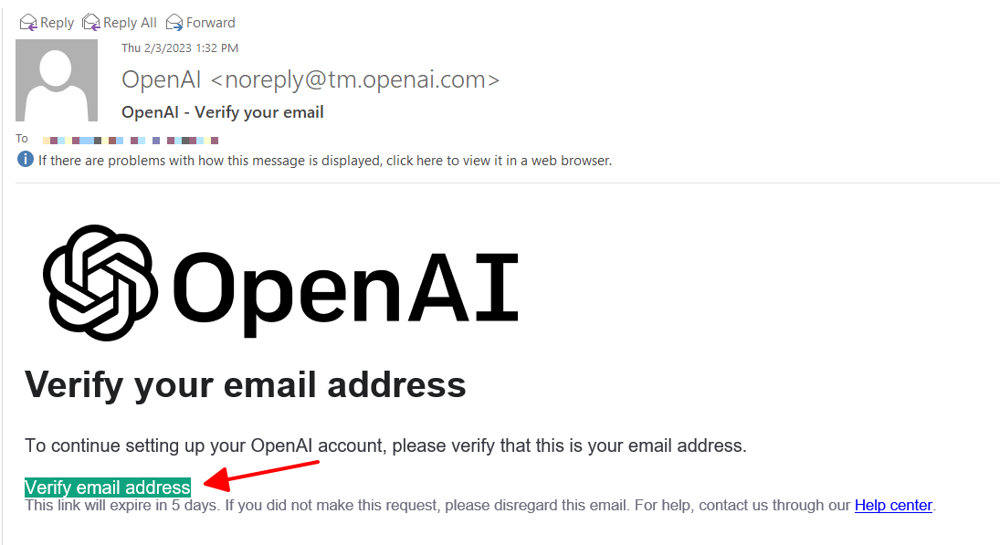

# Hướng dẫn tạo tài khoản và sử dụng ChatGPT tại Việt Nam

Trong bài viết này, chúng ta sẽ hướng dẫn bạn [cách tạo tài khoản](huong-dan-tao-tai-khoan-va-su-dung-chatgpt-tai-viet-nam.md#huong-dan-tao-tai-khoan-chatgpt) và [sử dụng ChatGPT](huong-dan-tao-tai-khoan-va-su-dung-chatgpt-tai-viet-nam.md#huong-dan-su-dung-tai-khoan-chatgpt).

## Cài đặt và kết nối vào VPN

Hiện tại, ChatGPT đang gặp phải vấn đề về việc bị chặn tại Việt Nam. Điều này có nghĩa là người dùng tại Việt Nam sẽ không thể truy cập vào trang web của ChatGPT một cách thông thường bằng cách nhập địa chỉ trang web trực tiếp trên trình duyệt.

Để truy cập ChatGPT từ Việt Nam, người dùng có thể sử dụng VPN để vượt qua rào cản chặn truy cập từ các nhà cung cấp dịch vụ mạng tại Việt Nam. VPN cho phép người dùng truy cập vào mạng bằng cách ẩn danh địa chỉ IP và cho phép kết nối từ một địa chỉ IP khác nằm ngoài khu vực bị chặn, giúp người dùng có thể truy cập vào ChatGPT và các trang web khác bị chặn một cách dễ dàng và nhanh chóng.

Ở bài viết này, tôi sẽ hướng dẫn bạn sử dụng VPN từ Chrome Extension. Tuy nhiên, bạn cũng có thể sử dụng phần mềm VPN khác như NordVPN, ExpressVPN, CyberGhost VPN, Surfshark, v.v... Miễn sao, đạt được hiệu quả là chuyển vùng truy cập sang quốc gia khác Việt Nam.

### Bước 1: Cài Chrome Extension - Browsec VPN

Bạn có thể tải và cài đặt tiện ích từ [Cửa hành Chrome trực tuyến](https://chrome.google.com/webstore/detail/browsec-vpn-free-vpn-for/omghfjlpggmjjaagoclmmobgdodcjboh?hl=vi) hoặc từ [trang chủ Browsec VPN](https://browsec.com/en/).

<figure><figcaption><p>Tiện ích Browsec VPN trên Cửa thàng chrome trực tuyến</p></figcaption></figure>

### Bước 2: Thay đổi cấu hình sang quốc gia United States

Bạn chọn vào Change và chọn quốc gia là United States nhé.

<figure><figcaption><p>Thay đổi quốc gia sang United States</p></figcaption></figure>

### Bước 3: Kích hoạt VPN và tận hưởng thành quả

Nhấp vào biểu tượng kịch hoạt và tận hưởng thành quả thôi. :smile:

## Hướng dẫn tạo tài khoản ChatGPT

### Bước 1: Chuẩn bị số điện thoại Hoa Kỳ và xác thực tin nhắn mà ChatGPT gửi về.


[https://sms-man.com/?ref=REY4KC0rb8\_R](https://sms-man.com/?ref=REY4KC0rb8\_R)


Có 2 cách để chuẩn bị một số điện thoại Hoa Kỳ để nhận tin. Tuy nhiên, nếu bạn là người dùng cá nhân, chỉ có  nhu cầu tạo 1 tài khoản ChatGPT thì mình khuyến nghị bạn nên chọn cách 2.

#### Cách 1: Truy cập vào trang [SMS-MAN](https://sms-man.com/?ref=REY4KC0rb8\_R)&#x20;

Để kích hoạt tài khoản SMS-MAN và thuê số điện thoại, **người dùng cần nạp tiền vào tài khoản của mình**. Một trong những cách phổ biến nhất để nạp tiền vào tài khoản SMS-MAN là sử dụng thẻ Visa.

Để nạp tiền vào tài khoản SMS-MAN bằng thẻ Visa, người dùng cần truy cập vào trang web của SMS-Man và đăng nhập vào tài khoản của mình. Sau đó, người dùng chọn phương thức thanh toán là thẻ Visa và nhập các thông tin thẻ của mình như số thẻ, ngày hết hạn và mã CVV.

Sau khi nhập thông tin thẻ thành công, người dùng cần chọn số tiền cần nạp vào tài khoản. Thông thường, để [kích hoạt SMS-MAN và thuê số điện thoại](https://sms-man.com/?ref=REY4KC0rb8\_R), người dùng cần **nạp ít nhất 10 USD** vào tài khoản.

Sau khi nạp tiền thành công, người dùng có thể sử dụng SMS-MAN để thuê số điện thoại và nhận các mã xác nhận từ các dịch vụ trực tuyến một cách dễ dàng và tiện lợi.

#### Cách 2: Liên hệ mình để được hỗ trợ thuê số điện thoại Hoa Kỳ (có tính phí)

Nếu bạn chưa có Visa hoặc không có nhu cầu cần nhiểu số điện thoại thì có thể liên hệ mình để thuê một vài số điện thoại để sử dụng.

Có thể liên hệ với mình qua [Fanpage Nguyen Quy Blog](https://www.messenger.com/t/nhquydev.net?start=chatgpt) hoặc [Zalo Nguyễn Quý](https://zalo.me/qpcoders) để được hỗ trợ nhé.

### Bước 2: Truy cập trang web ChatGPT


[https://chat.openai.com/](https://chat.openai.com/)


Để tạo tài khoản ChatGPT, bạn cần truy cập trang web của nó. Bạn có thể truy cập trang web ChatGPT bằng cách tìm kiếm trên trình duyệt hoặc truy cập theo đường dẫn sau: [https://chat.openai.com/](https://chat.openai.com/)

### Bước 3: Đăng ký tài khoản

Sau khi truy cập trang web ChatGPT, bạn sẽ thấy nút "Sign up" ở góc phải của trang. Nhấp vào nút này để bắt đầu quá trình đăng ký tài khoản.

Bạn cần cung cấp các thông tin cần thiết để đăng ký tài khoản, bao gồm tên của bạn, địa chỉ email và mật khẩu. Sau khi điền đầy đủ thông tin, nhấp vào nút "Sign up" để hoàn thành quá trình đăng ký.

<figure><figcaption><p>Đăng ký tài khoản ChatGPT</p></figcaption></figure>

### Bước 4: Mở email xác thực tài khoản

Khi bạn nhận được email từ ChatGPT, hãy bấm vào "Verify email address" để xác thực email.&#x20;

<figure><figcaption><p>email xác thực của chatgpt</p></figcaption></figure>

### Bước 5: Điền số điện thoại và kích hoạt tài khoản

Sau đó, bạn điền đầy đủ thông tin và số điện thoại Hoa Kỳ đã chuẩn bị ở [Bước 1](huong-dan-tao-tai-khoan-va-su-dung-chatgpt-tai-viet-nam.md#buoc-1-chuan-bi-so-dien-thoai-hoa-ky-va-xac-thuc-tin-nhan-ma-chatgpt-gui-ve.)

Lấy mã OTP ở số điện thoại và kích hoạt tài khoản

Tới đây là hoàn thành đăng ký rồi, giờ [đăng nhập](huong-dan-tao-tai-khoan-va-su-dung-chatgpt-tai-viet-nam.md#huong-dan-su-dung-tai-khoan-chatgpt) vào và trải nghiệm dịch vụ thôi nào.

## Hướng dẫn sử dụng tài khoản ChatGPT

### Bước 1: Đăng nhập vào tài khoản ChatGPT

Bạn có thể truy cập trang web ChatGPT bằng cách tìm kiếm trên trình duyệt hoặc truy cập theo đường dẫn sau: [https://chat.openai.com/](https://chat.openai.com/)

Sau đó sử dụng [tài khoản đã đăng ký thành công](huong-dan-tao-tai-khoan-va-su-dung-chatgpt-tai-viet-nam.md#huong-dan-tao-tai-khoan-chatgpt), bạn cần đăng nhập để sử dụng ChatGPT. Nhấp vào nút "Log in" ở góc phải của trang và nhập địa chỉ email và mật khẩu mà bạn đã đăng ký. Nhấp vào nút "Log in" để tiếp tục.

### Bước 2: Sử dụng ChatGPT

Sau khi đăng nhập vào tài khoản, bạn có thể sử dụng ChatGPT để trò chuyện với trợ lý ảo. Để bắt đầu trò chuyện, bạn có thể nhấp vào nút "Start chatting" hoặc nhập câu hỏi của bạn vào ô trống ở trung tâm của trang và nhấn Enter.

ChatGPT sẽ trả lời câu hỏi của bạn trong vài giây và bạn có thể tiếp tục trò chuyện bằng cách nhập thêm câu hỏi hoặc chọn các câu trả lời được đề xuất.

Ví dụ đặt câu hỏi:

```
Trò chuyện: Với tư cách là nhà nghiên cứu AI.
Ngôn ngữ: Tiếng Việt.
Chủ đề: Nghiên cứu ứng dụng của ChatGPT vào Excel
Đề xuất: 
1. Viết tiêu đề giới hạn 50 từ.
2. Viết giới thiệu tiệu đề giới hạn 100 từ.
3. Viết bài nghiên cứu chủ đề trên ít nhất 2000 từ, tránh lặp từ, sử dụng đoạn văn chi tiết, rất chi tiết, cực kì chi tiết và đưa ra ít nhất 2 ví dụ cụ thể cho các công thức excel.
```

Ngoài ra, xem thêm các ví dụ khác tại [https://platform.openai.com/examples](https://platform.openai.com/examples)

## Kết luận

Vậy là chúng ta đã [hướng dẫn cách tạo tài khoản và sử dụng ChatGPT](huong-dan-tao-tai-khoan-va-su-dung-chatgpt-tai-viet-nam.md) một cách đơn giản và dễ dàng. ChatGPT là một công cụ hữu ích và tiện lợi trong việc xử lý ngôn ngữ tự nhiên và phát triển các ứng dụng trí tuệ nhân tạo. Bằng cách [sử dụng ChatGPT](huong-dan-tao-tai-khoan-va-su-dung-chatgpt-tai-viet-nam.md#huong-dan-su-dung-tai-khoan-chatgpt), bạn có thể dễ dàng tạo ra các ứng dụng chatbot, dịch văn bản và phân tích ngôn ngữ tự nhiên.

Nếu bạn là một nhà phát triển, ChatGPT cũng có các tính năng API để tích hợp vào các ứng dụng của bạn. Chúng tôi hy vọng rằng bài viết này sẽ giúp bạn có thể tạo tài khoản và sử dụng ChatGPT một cách hiệu quả. Nếu bạn còn bất kỳ câu hỏi nào, hãy tham khảo trang trợ giúp của ChatGPT hoặc liên hệ với đội ngũ hỗ trợ của họ để được giúp đỡ.
